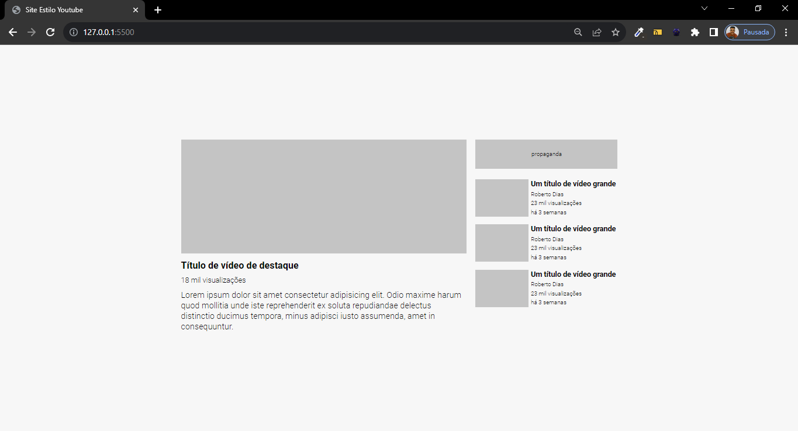

# Exercício 05 - HTML e CSS Avançado Grid - Layout YouTube com Grid
 No exercício, tive que usar os conheciementos de HTML CSS avançado flexbox e grid para criar um site com um layout básico parecido com o do YouTube.

 ## HTML
 Usei uma simplis estrutura HTML para criar todo o corpo do site. Uma div com a classe container para criar o grid e outras duas divs para criar as demais áreas da página.

 ## CSS
 No CSS, eu importei a fonte, resetei o margin e o padding de todos os elementos e defini o box sizing como border box.
 Utilizei os conhecimentos de grid para definir uma grid de duas colunas, uma com largura de 543px e outra de 270px, e uma linha. Usei flex box para alinhas e posicionar os elementos de forma mais específica.

 ## Resultado
 